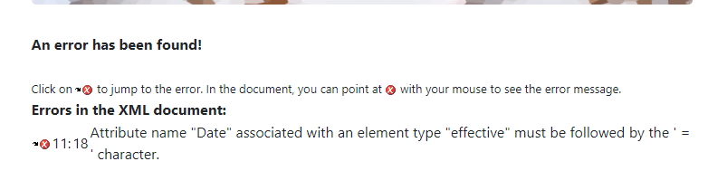
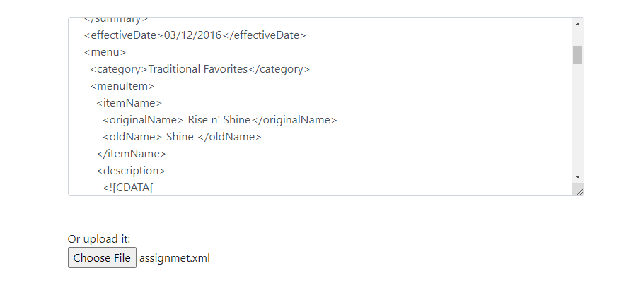
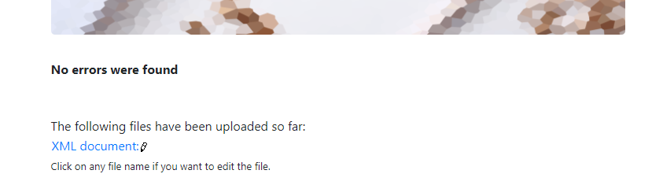
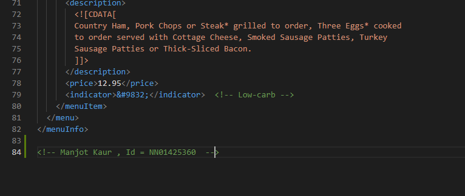
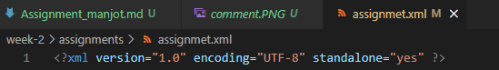
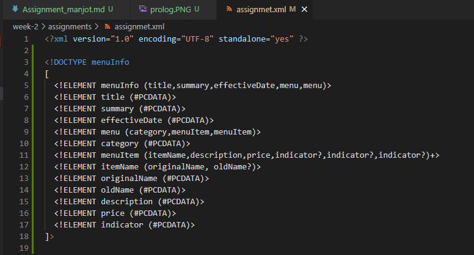
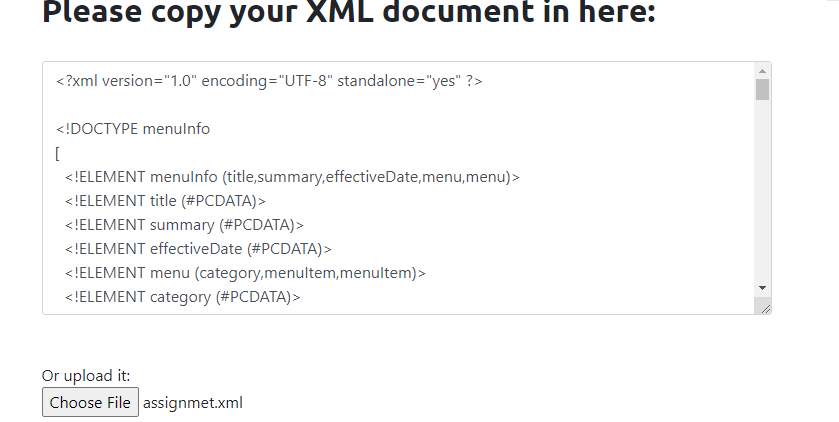
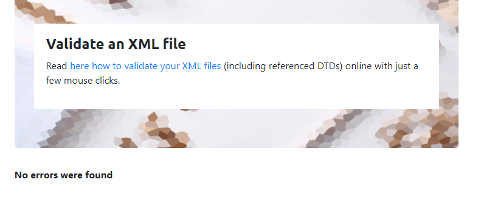

 Q1.) Open `week-2/assignments/assignment.xml` in your browser. Are there any errors? Explain the error and fix it.

error = there is space between effectiveDate which cause error so space between them should be removed.

Q2.)What is the use of CDATA block in this document?

ans= To hide symbol in xml that are not recognised by xml so we use CDATA.

Q3.)Add comment line to the end of file which contains you name and student id.

Q4.) Identify prolog, document body, and epilog in the document. Are there any processing instructions?

document body = from start to end each tag is written in document body.

epilog = there is no any epilog in the document.

Q5.) Add inline DTD for this document.

Q6.) Verify that file is well-formed and valid.

Q7.)  Create `style.css` file and link it to the file. Add the following styles to the .css:

