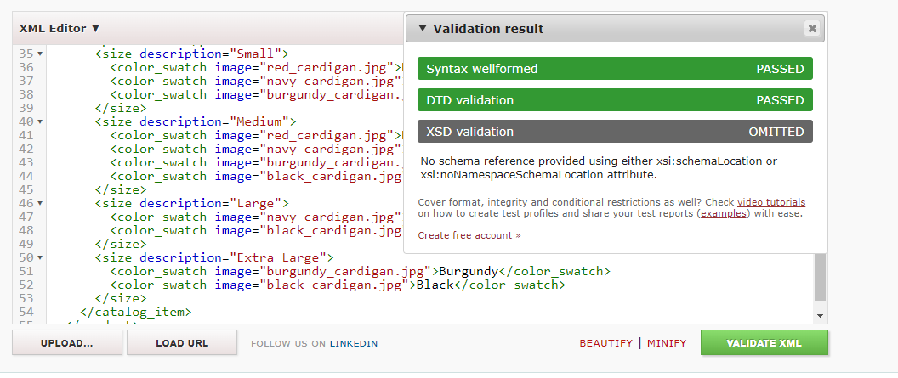
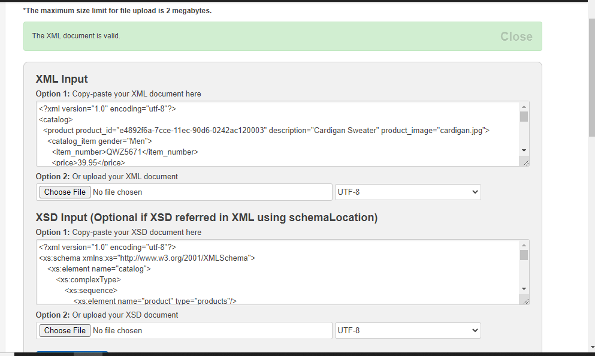

# Assignment

1. Open `week-3/assignments/assignment.xml` in your editor
2. Create DTD for this file and validate it using any of the tools we used
3. Create XSD for this file and validate it using any of the tools we used
4. Explain your thought process for these 2 declarations

Create `week-3/assignments/assignment_YOURNAME.md` and add your theory answers. Add screenshots of each step to the file (Refer `week-1/assignments/evaluation-1.md` on how to add image to md file)

Q.4)Explain your thought process for these 2 declarations.
ans- by using DTD we can define format of XMl files according the way we want.so user can easily understand its structure.we can check validation of Xml file whether code  attributes and elements are written in right order or not.

XSD helps us to define structure and element types for xml document. we can inherit new elements from existing elements.

